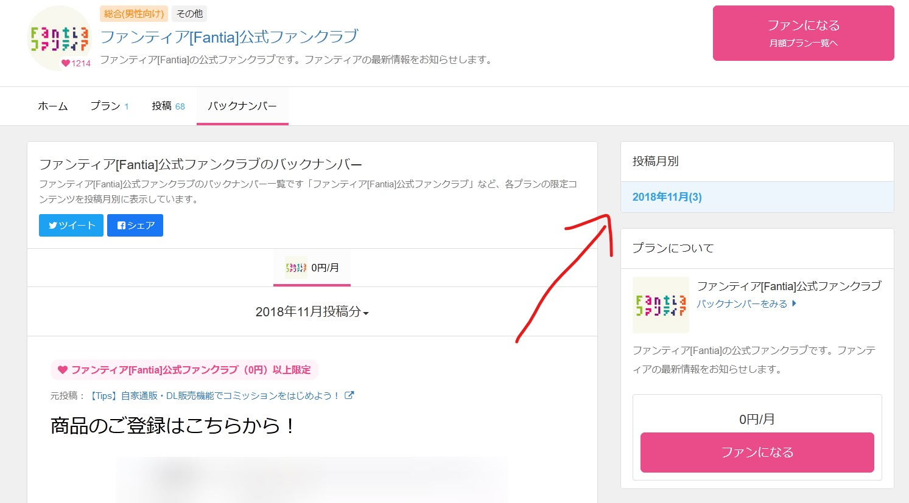

# Fantia DL

[日本語](./docs/README_ja.md)

CLI tool to download contents from [Fantia](https://fantia.jp/)

## Install

`fantia-dl` does not require any installation.
You can download the executable from [releases](https://github.com/KleinChiu/fantia-dl/releases) and use it directly by specifying the path.
Otherwise, you can install it via go cli

```cli
go install github.com/KleinChiu/fantia-dl
```

## Usage

```sh
Usage:

        fantia-dl <post|backnumber> [arguments]
```

### Post

You can download all contents of a post with its url

```sh
fantia-dl post --url https://fantia.jp/posts/1 --session your_session_string
```

### Backnumber

You can download all contents of a backnumber with its url

```sh
fantia-dl backnumber --url https://fantia.jp/fanclubs/1/backnumbers?month=201811&plan=1 --session your_session_string
```

> The url to download backnumber is a bit different to the url shown in the URL field sometime. You can copy the url from the right hand side.
> 

## Q&A

### Where is the Session ID, how do I find it?

Session ID is a string that represent your login state.
`fantia-dl` need it to download content from Fantia, and will only use it to download contents.
Some contents are member only, please copy the value after you logged in.

For Google Chrome / Microsoft Edge,

1. Press F12 to open "Developer Tools"
2. Switch to "Application" tab
3. Copy the value of "\_session_id" under Cookies > https://fantia.jp

For Firefox,

1. press F12 to open "Web Developer Tools"
2. Switch to "Storage" tab
3. Copy the value of "\_session_id" under Cookie > https://fantia.jp
